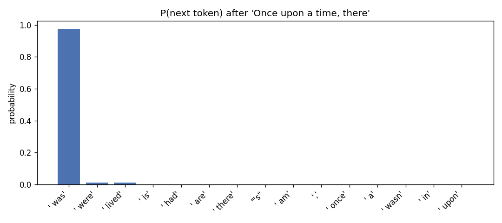
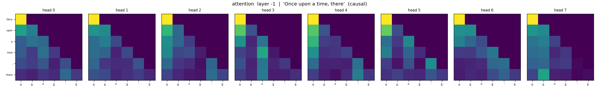
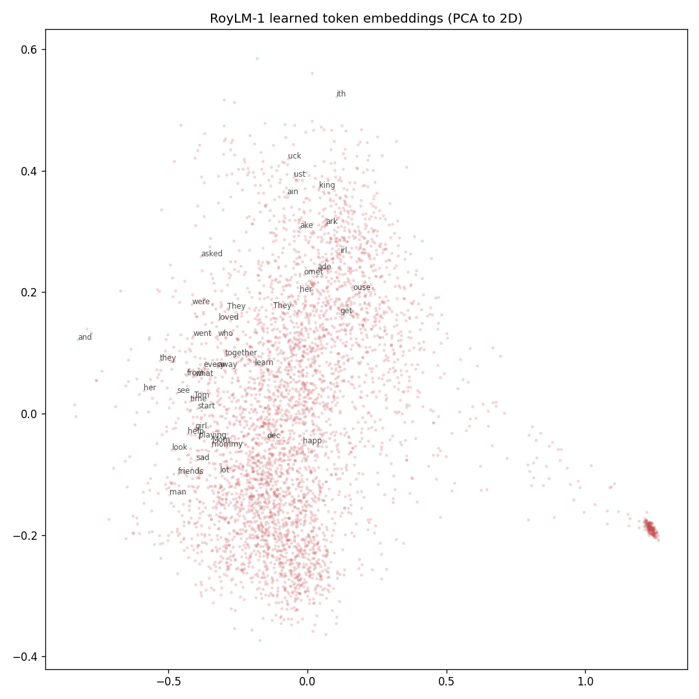

# RoyLM-1

RoyLM-1 is a small decoder-only GPT trained from scratch using a **byte-level
BPE tokenizer**. It moves beyond the character-level modeling of
[RoyLM-0](https://github.com/ryouol/RoyLM-0) by learning subword tokens and
training on natural story data (TinyStories).

It is not instruction-tuned and not a chatbot. It is a base language model: it
continues text in the style of its training data, one **token** at a time.

```
RoyLM-0 (character-level)   "hello world" -> h e l l o _ w o r l d   (11 tokens)
RoyLM-1 (subword/token)     "hello world" -> ["hello", " world"]      (2 tokens)
```

## Visualizations

These plots were generated from the trained checkpoint with
`python -m roylm.visualize` using the prompt `Once upon a time, there`.



After `Once upon a time, there` the model puts ~98% of its probability on
` was` — it has learned the grammar of the construction.





The embedding plot shows the 4,096 learned token vectors projected to 2D. Common
words (`they`, `her`, `mom`, `loved`, `friends`) spread out and cluster by role,
while rarely-seen tokens stay bunched together near their initialization.

## Model Stats

### Architecture

| Stat | Value |
| --- | --- |
| Type | Decoder-only transformer (GPT) |
| Parameters | **5.85M** |
| Layers (`n_layer`) | 6 |
| Attention heads (`n_head`) | 8 |
| Embedding width (`n_embd`) | 256 |
| Head size | 32 |
| Context length (`block_size`) | 256 tokens |
| Vocabulary | 4,096 (byte-level BPE) |
| Dropout | 0.1 |
| Checkpoint size | 23.8 MiB (`roylm-1.pt`, fp32) |
| Weight tying | input embedding = output head |

The output layer now spans 4,096 possible next tokens (`[B, T, 4096]` logits)
instead of RoyLM-0's ~65 characters. This is the real change: RoyLM-1 predicts
subword tokens, the way modern LLMs do.

### Training Setup

| Stat | Value |
| --- | --- |
| Dataset | TinyStories (200 MB slice) |
| Train split | 50.18M tokens |
| Validation split | 4.86M tokens |
| Batch size | 16 sequences |
| Sequence length | 256 tokens |
| Steps (`max_iters`) | 30,000 |
| Tokens seen | **123M** (~2.45 passes over the train split) |
| Optimizer | AdamW |
| Learning rate | 3e-4 (constant) |
| Gradient clipping | 1.0 |
| Hardware | Apple Silicon GPU (MPS) |
| Wall-clock training time | ~50 minutes |

With a constant learning rate, validation loss fell quickly and then flattened
(see `notes/roylm-1-training-log.md`) — the diminishing returns that motivate a
learning-rate schedule in RoyLM-2.

### Validation Benchmark

Measured from the trained `roylm-1.pt` checkpoint. Perplexity is `e^loss`; a
uniform guess over the 4,096-token vocabulary has perplexity 4,096.

| Metric | Random baseline | RoyLM-1 |
| --- | ---: | ---: |
| Cross-entropy loss, nats | 8.32 | **1.86** |
| Perplexity (`e^loss`) | 4096 | **6.43** |
| Bits per token | 12.0 | **2.68** |

## Setup

```bash
python3 -m venv .venv
source .venv/bin/activate
pip install -r requirements.txt
```

## Run

Run from the repo root. Prepare the dataset (download → train tokenizer → encode):

```bash
python data/tinystories/download.py
python data/tinystories/train_tokenizer.py
python data/tinystories/prepare.py
```

Train the model:

```bash
python -m roylm.train
```

Generate a sample:

```bash
python -m roylm.sample --prompt "Once upon a time" --tokens 300
```

Try an interactive prompt:

```bash
python -m roylm.prompt
```

Create the diagnostic plots:

```bash
python -m roylm.visualize
```

## Project Layout

- `roylm/config.py` — paths and model/training hyperparameters (one source of truth).
- `roylm/tokenizer_bpe.py` — byte-level BPE wrapper (train / load / encode / decode).
- `roylm/model.py` — the decoder-only transformer.
- `roylm/train.py` — trains the model and saves `checkpoints/roylm-1.pt`.
- `roylm/sample.py` — generates text from a checkpoint.
- `roylm/prompt.py` — interactive text-continuation REPL.
- `roylm/visualize.py` — writes the attention, embedding, and next-token plots.
- `data/tinystories/` — `download.py`, `train_tokenizer.py`, `prepare.py`.

Generated data, the tokenizer, checkpoints, and virtual environments are ignored
by Git. The visualization PNGs are kept in the repo so they render on GitHub.

## Next

RoyLM-2 turns this into a real pretraining pipeline: a larger model, a learning-
rate schedule, gradient accumulation, checkpoint resume, CSV experiment logs, and
evaluation tooling.
